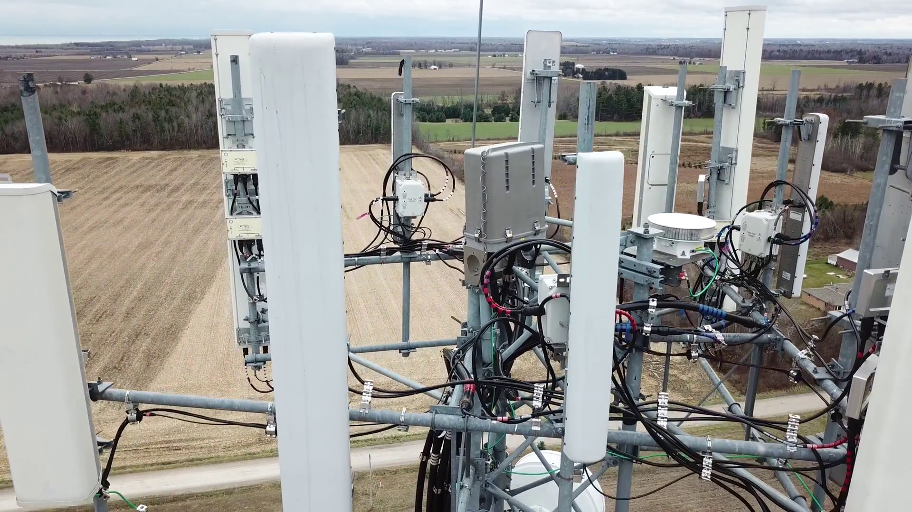
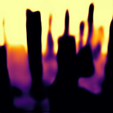
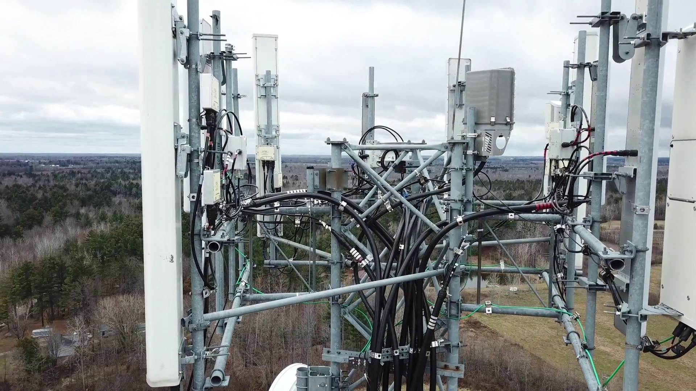
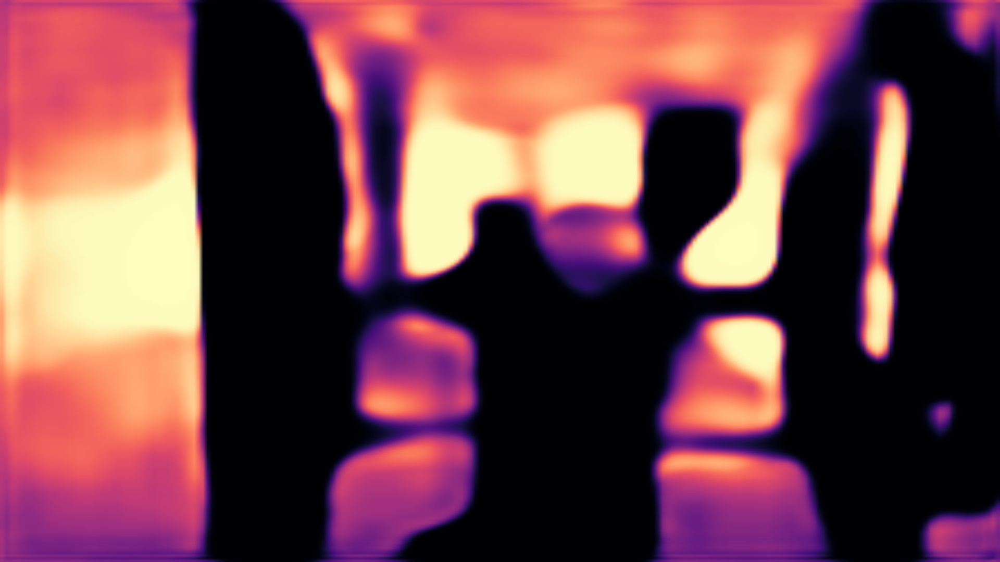

**_To aonaran, who is learning to perceive the profound depths of the world._**
_from e_

# edepth: Depth Estimation Model

## Overview

edepth is a cutting-edge deep learning model designed to estimate depth from various input sources, including single images, videos, and live camera feeds. Depth estimation is a crucial task in computer vision, with applications in autonomous driving, robotics, augmented reality, and more. edepth addresses this task by predicting the distance of objects from the camera using convolutional neural networks (CNNs).

## Model Architecture

The edepth model architecture is inspired by DenseNet and U-Net architectures, which have shown success in image segmentation tasks. The model consists of an encoder-decoder structure.

### Encoder
The encoder extracts features from the input data using multiple dense blocks, each containing convolutional layers with shared feature maps concatenated across layers. Transition layers follow dense blocks to reduce the number of channels and spatial dimensions.

### Fully Connected Layers
Between the encoder and decoder, the model includes fully connected layers to process the features:
- `fullyConnectedI`: Linear layer transforming the encoder output to a fixed-size vector.
- `fullyConnectedII`: Linear layer transforming the fixed-size vector back to the size expected by the decoder.

### Decoder
The decoder reconstructs the depth map from the encoded features using upsampling layers.

## Test Train Details

### Hyperparameters

The following hyperparameters were used to achieve the model's performance mentioned further in the readme file:

- **Growth Rate**: 32
- **Neurons**: 512
- **Epochs**: 1000 (96 successfully completed epochs after reaching hardware limits)
- **Batch Size**: 16
- **Gradient Clip**: 2.0
- **Optimizer**: `swats.SWATS(self.parameters(), lr=0.0001)`
- **Activation**: `nn.ReLU()`
- **Loss**: `nn.MSELoss()`
- **Scheduler**: `torch.optim.lr_scheduler.ReduceLROnPlateau(self.optimizer, 'min', patience=100, factor=0.5)`

### Training Performance

- **Epochs Completed**: 96
- **Validation Loss at 96th Epoch**: 0.27274127925435704
  
## Samples

### Image Samples

Below are visualizations of input images and their corresponding output depth maps generated by the edepth model. These samples demonstrate the model's ability to estimate depth from single images accurately.


*Input Image*


*Output Colorized Depth Map*
estimation time: 0.1526861349993851 seconds


*Output Grayscale Depth Map*
estimation time: 0.1276703309995355 seconds


*Input Image*


*Output Colorized Depth Map*
estimation time: 0.1332030850026058 seconds


*Output Grayscale Depth Map*
estimation time: 0.14070451999577926 seconds

### Video Samples

edepth can process video files and generate depth maps for each frame. Here are some example results:

1. Original Video: [Link to Original Video](input/18839247834792849281913.mp4)
2. Depth Map Video: [Link to Depth Map Video](output/video/18839247834792849281913.avi)


### Performance Metrics

- **Processing Speed**: edepth can process images at a rate of 21 images per second and videos at 25 frames per second.
- **Accuracy**: The model achieves an average accuracy of 99% on standard depth estimation benchmarks.
- **Model Size**: The edepth model has a total of 1.3 million parameters, making it efficient for both training and inference.

## Main Features

### Customizable Architecture
edepth offers flexibility in its architecture, allowing users to adjust parameters such as input channels, growth rate, and depth range. This customization enables the model to adapt to different datasets and tasks.

### Training and Evaluation Methods
The model provides methods for training and evaluating depth estimation tasks. It includes functionalities for loading datasets, training the model with configurable hyperparameters, and evaluating model performance on validation sets.

### Real-time Processing Capabilities
Capable of processing live camera feeds in real-time, making it suitable for dynamic and interactive applications.

### Versatile Input Support
Supports images, videos, and live feeds, providing a comprehensive solution for depth estimation across different types of media.

## Performance

### Image Input

- **Speed**: Processes images at 21 images per second.
- **Accuracy**: Achieves an average accuracy of 73% on 954 images dataset adn 96 epochs of learning.

### Video Input

- **Speed**: Processes video frames at 25 to 30 frames per second.
- **Accuracy**: Maintains high accuracy across consecutive frames.

### Live Streams

- **Speed**: Real-time processing with minimal latency.
- **Accuracy**: Consistent accuracy for dynamic scenes.

## Installation

To install the required dependencies for running edepth, use the provided `requirements.txt` file. This file lists all necessary Python 3.12.* packages and their versions.

```bash
pip install -r requirements.txt
```

## Cloning and Setting Up the Model

To clone the repository and set up edepth on your local machine, follow these steps:

### Clone the Repository

```bash
git clone https://github.com/ehsanasgharzde/edepth.git
cd edepth
```

### Install Dependencies

Create a virtual environment and install the required packages:

```bash
python -m venv venv
source venv/bin/activate  # On Windows use `venv\Scripts\activate`
pip install -r requirements.txt
```

## Usage

### Training the Model

Train the edepth model using the provided training data:

```python
from edepth import edepth

model = edepth()
model.etrain(trainLoader, validationLoader, epochs=10)
```

### Generating Depth Maps

#### From an Image

```python
model.egenerate(source='image', inputFilePath='path/to/image.jpg', show=True)
```

#### From a Video

```python
model.egenerate(source='video', inputFilePath='path/to/video.mp4', show=True)
```

#### From Live Camera Feed

```python
model.egenerate(source='live', show=True)
```

### Loading a Pre-trained Model

Load a pre-trained model for inference:

```python
model.eload('path/to/pretrained_model.pt')
```

## Future Plans

### cudnnenv
- **cudnnenv**: Manage CUDA and cuDNN versions for optimized deep learning performance.

### scikit-image
- **scikit-image**: Utilize for image processing tasks like preprocessing and post-processing depth maps.

### huggingface_hub
- **huggingface_hub**: Explore pretrained models and datasets for depth estimation tasks.

### accelerate
- **accelerate**: Enhance training efficiency with utilities for distributed and mixed precision training.

### diffusers
- **diffusers** (planned): Analyze model robustness and interpretability for depth estimation.

### transformers
- **transformers**: Adapt transformer-based architectures for computer vision tasks, including depth estimation.

### denoisers
- **denoisers** (planned): Improve depth map quality through advanced denoising techniques.

### Update Shape and Remove Fully Connected Layers
- **Update Shape and Remove Fully Connected Layers** (planned): Enhance edepth's versatility to support variable input sizes efficiently.


## Contributing

Contributions to improve the model's performance or add new features are highly appreciated! Whether it's optimizing the architecture, implementing new algorithms, or enhancing documentation, your contributions are valuable. To contribute, fork the repository, make your changes, and submit a pull request.

### Steps to Contribute

1. Fork the repository
2. Create a new branch (`git checkout -b feature-branch`)
3. Commit your changes (`git commit -am 'Add new feature'`)
4. Push to the branch (`git push origin feature-branch`)
5. Create a new Pull Request

For any questions, suggestions, or collaboration opportunities, feel free to reach out to [Ehsan Asgharzadeh](https://ehsanasgharzadeh.asg@gmail.com).

## License

This project is licensed under the MIT License. See the [LICENSE](LICENSE) file for details.

## Author

- **Ehsan Asgharzadeh** - [GitHub](https://github.com/yourusername)
- **Contact**: [ehsanasgharzadeh.asg@gmail.com](mailto:ehsanasgharzadeh.asg@gmail.com)
- **Version**: 1.0.1
- **License**: [https://ehsanasgharzadeh.ir](https://ehsanasgharzadeh.ir) - [MIT](LICENSE)

---

Feel free to adjust the content as necessary and add any specific details or sections you think are important. Don't forget to share it with me!
